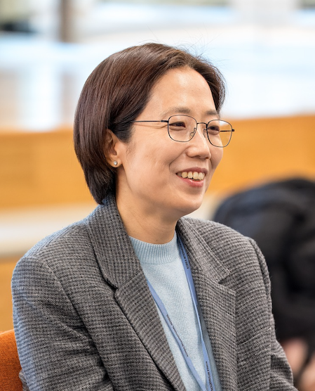
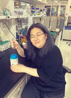
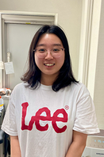
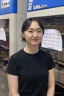
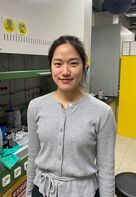
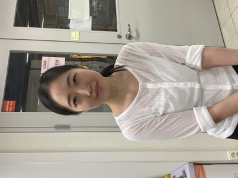
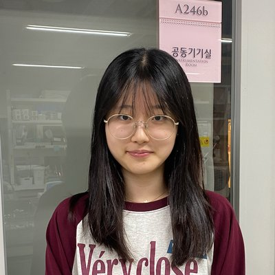

## Principal Investigator

:::: profile-box
::: profile-photo

:::
::: profile-info
### 이지연 (Jiyoun Lee)

Professor\
School of Biopharmaceutical and Medical Sciences\
Sungshin University

[Google Scholar](https://scholar.google.co.kr/citations?user=UC9dtGIAAAAJ&hl=en)\
[ORCID](http://orcid.org/0000-0003-3819-5889)\
[CV](assets/JLee_CV.pdf)\
Email: jlee at sungshin.ac.kr\
Phone: +82-2-920-7281
:::
::::

### Education

- 2006: Ph.D. in Bioinorganic Chemistry, Northwestern University (Advisor: Prof. Thomas J. Meade)
- 2000: M.S. in Medicinal Chemistry, Seoul National University (Advisor: Prof. Jeewoo Lee)
- 1998: B.S. in Pharmacy, Seoul National University

### Experience

- 2023–Present: Professor, School of Biopharmaceutical and Medical Sciences, Sungshin University
- 2021–2022: Associate Professor, School of Biopharmaceutical and Medical Sciences, Sungshin University
- 2018–2022: Associate Professor, Department of Global Medical Science, Sungshin University
- 2012–2017: Assistant Professor, Department of Global Medical Science, Sungshin University
- 2010–2012: Senior Research Scientist, Korea Institute of Science and Technology
- 2008–2010: Postdoctoral Research Associate, Stanford University School of Medicine (Advisor: Prof. Matthew Bogyo)
- 2006–2007: Postdoctoral Research Associate, University of California, Berkeley (Advisor: Prof. Christopher J. Chang)

## Current Members

<!--
새 멤버 추가: 아래 ::: member-card ... ::: 블록을 통째로 복사해서
member-grid 안 마지막 카드 뒤에 붙여넣고, 사진 파일명/이름/직함만 바꾸면 됩니다.
사진은 images/people/ 폴더에 정사각형 비율로 넣어주세요.
-->

:::::::: member-grid
::: member-card

**김은지**\
Ph.D. student
:::

::: member-card

**김혜민**\
M.S. student
:::

::: member-card

**박주희**\
Combined B.S./M.S. student
:::

::: member-card

**신보영**\
M.S. student
:::
::::::::

:::::::: member-grid
::: member-card

**임수민**\
Undergraduate researcher
:::

::: member-card

**이유진**\
Undergraduate researcher
:::

::: member-card

<svg xmlns="http://www.w3.org/2000/svg" width="54" height="54" viewBox="0 0 24 24" fill="#94a3b8"><path d="M12 12c2.7 0 4.8-2.1 4.8-4.8S14.7 2.4 12 2.4 7.2 4.5 7.2 7.2 9.3 12 12 12zm0 2.4c-3.2 0-9.6 1.6-9.6 4.8v2.4h19.2v-2.4c0-3.2-6.4-4.8-9.6-4.8z"/></svg>

**박성은**\
Undergraduate researcher
:::
::::::::

## Alumni

<!--
졸업생 추가 형식: - 이름, 학위 연도–연도, 현재 소속(선택)
-->
- 류주희, M.S. 2024–2026
- 이유나, M.S. 2024–2026, 대구경북첨단의료산업진흥재단 신약개발센터
- 한수정, M.S. 2023–2025, 한국건설생활환경시험연구원
- 박은채, M.S. 2021–2023, 이람화학
- 이지유, M.S. 2020–2022, 피코엔텍
- 홍종아, M.S. 2016–2018, 식약처
- 나여경, M.S. 2015–2017, 단디큐어

## Honorary Members

<!--
새 연도 추가 형식:
**연도**

- 이름, 직함/소속
-->

::: {.honorary-list}
**2024**

- 전혜빈, M.S. student
- 박수윤, Undergraduate researcher (화학에너지융합학부)
- 정지현, Undergraduate researcher (화학에너지융합학부 4학년)

**2022**

- 최나은, Researcher, 펩스젠

**2021**

- 송유정, Undergraduate researcher (바이오생명공학과 졸업)
- 이설아, Undergraduate researcher (글로벌의과학과 졸업)

**2020**

- 이주희, Undergraduate researcher (글로벌의과학과 졸업)

**2019**

- 어진이, Researcher/Undergraduate researcher (2018), 강원대 의전원

**2018**

- 송다솜, Researcher, 광주과기원 화학과 박사과정
- 박영훈, Graduate student

**2017**

- 박은비, Undergraduate researcher, 소위임관
- 정혜지, Undergraduate researcher, DGIST 뇌인지과학전공 석사과정
- 최다은, Undergraduate researcher
- 김민지, Undergraduate researcher

**2016**

- 김민지, Undergraduate researcher
- 정유진, Undergraduate researcher, AUA

**2015**

- 정수정, Undergraduate researcher
:::
