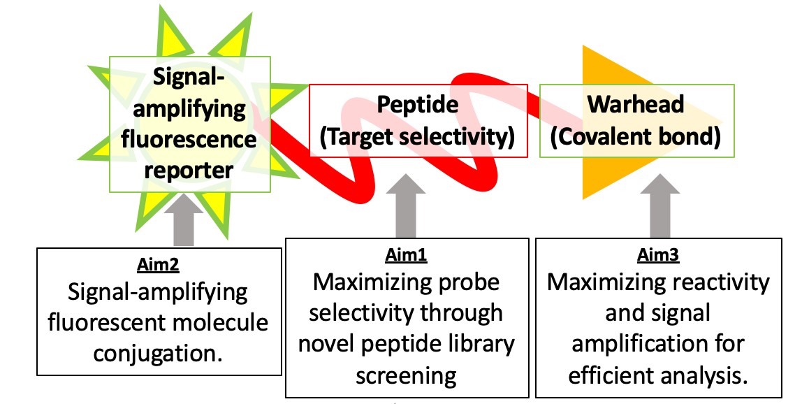
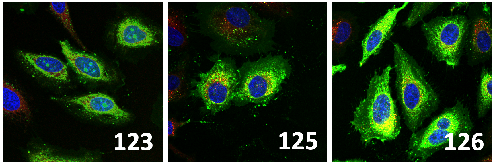
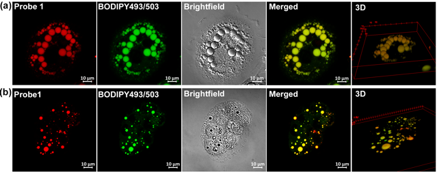

## Drug Target Discovery and Biomarker Identification Using Chemical Tools

Chemical probes are key players in searching for the potential druggability of new molecular targets, pathways, or biological processes. Particularly, pathfinder molecules in drug discovery projects aid the design and evaluation of biological assays and the identification of useful biomarkers.

Here are a few examples of chemical tools that our lab has primarily focused on studying.

::: research-list
::: research-item
### 1. Activity-Based Probes to Monitor Enzyme Activity

Activity-based probes react with specific classes of enzymes in a manner that correlates with enzyme activity, enabling the monitoring of enzyme function and activity in cells, animals, and disease models.

Our lab aims to develop activity-based probes for various proteases to study the pathogenesis of neurodegenerative diseases.

{fig-align="center" width="480"}
:::

::: research-item
### 2. Organelle-Targeting Peptidomimetics as Molecular Transporters

Recent advances in gene therapy and antibody drug development have brought renewed attention to molecular transporters as efficient delivery systems. Peptoids have unique advantages over other polymeric delivery scaffolds because they share physiological and chemical properties with peptides and proteins while offering superior metabolic and immunological stability.

{fig-align="center" width="372"}
:::

::: research-item
### 3. Molecular Biomarker Discovery and Fluorescent Probe Development

We design chemical tools and fluorescent probes to detect disease-associated molecular activities and support biomarker discovery.

{fig-align="center" width="386"}
:::
:::
