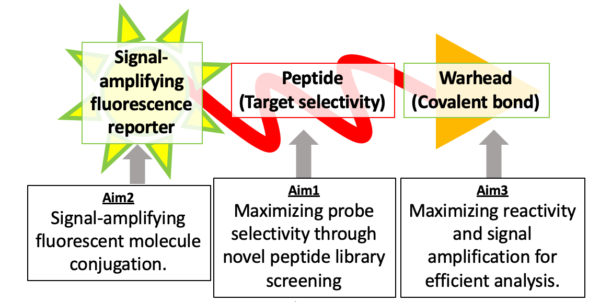
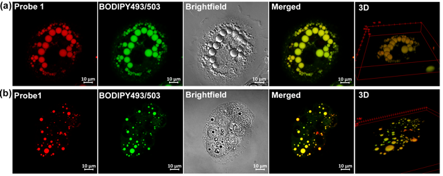
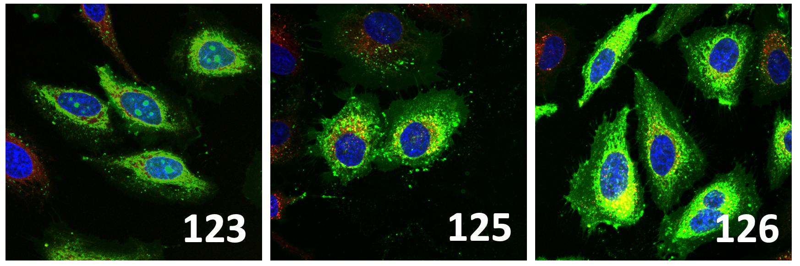

Our lab develops and applies small-molecule chemical tools to identify drug targets, study enzyme activity, and discover biomarkers relevant to neurodegenerative diseases and cancer.

```{=html}
<div style="display:grid;grid-template-columns:repeat(3,1fr);gap:1.5rem;margin:1.5rem 0 2rem;">

  <div style="border:1px solid #e2e8f0;border-radius:10px;overflow:hidden;background:#fff;transition:box-shadow 0.2s,transform 0.2s;" onmouseover="this.style.boxShadow='0 6px 20px rgba(15,23,42,0.10)';this.style.transform='translateY(-3px)'" onmouseout="this.style.boxShadow='none';this.style.transform='none'">
    
    <div style="padding:1rem 1.1rem 1.1rem;">
      <h4 style="font-size:0.9rem;font-weight:600;margin:0 0 0.5rem;color:#0b1a33;line-height:1.4;">1. Activity-Based Probes to Monitor Enzyme Activity</h4>
      <p style="font-size:0.85rem;line-height:1.6;color:#475569;margin:0;">Activity-based probes react with specific classes of enzymes in a manner that correlates with enzyme activity, enabling monitoring of enzyme function and activity in cells, animals, and disease models. Our lab develops probes for various proteases to study the pathogenesis of neurodegenerative diseases.</p>
    </div>
  </div>

  <div style="border:1px solid #e2e8f0;border-radius:10px;overflow:hidden;background:#fff;transition:box-shadow 0.2s,transform 0.2s;" onmouseover="this.style.boxShadow='0 6px 20px rgba(15,23,42,0.10)';this.style.transform='translateY(-3px)'" onmouseout="this.style.boxShadow='none';this.style.transform='none'">
    
    <div style="padding:1rem 1.1rem 1.1rem;">
      <h4 style="font-size:0.9rem;font-weight:600;margin:0 0 0.5rem;color:#0b1a33;line-height:1.4;">2. Molecular Biomarker Discovery and Fluorescent Probe Development</h4>
      <p style="font-size:0.85rem;line-height:1.6;color:#475569;margin:0;">We design chemical tools and fluorescent probes to detect disease-associated molecular activities and support biomarker discovery. Our probes enable imaging of enzyme activity in living cells and tissues.</p>
    </div>
  </div>

  <div style="border:1px solid #e2e8f0;border-radius:10px;overflow:hidden;background:#fff;transition:box-shadow 0.2s,transform 0.2s;" onmouseover="this.style.boxShadow='0 6px 20px rgba(15,23,42,0.10)';this.style.transform='translateY(-3px)'" onmouseout="this.style.boxShadow='none';this.style.transform='none'">
    
    <div style="padding:1rem 1.1rem 1.1rem;">
      <h4 style="font-size:0.9rem;font-weight:600;margin:0 0 0.5rem;color:#0b1a33;line-height:1.4;">3. Organelle-Targeting Peptidomimetics as Molecular Transporters</h4>
      <p style="font-size:0.85rem;line-height:1.6;color:#475569;margin:0;">Peptoids have unique advantages over other polymeric delivery scaffolds because they share physiological and chemical properties with peptides and proteins while offering superior metabolic and immunological stability. We develop mitochondria- and cell-targeting peptoids for intracellular delivery of small-molecule, protein, and nanoparticle cargos.</p>
    </div>
  </div>

</div>
```
